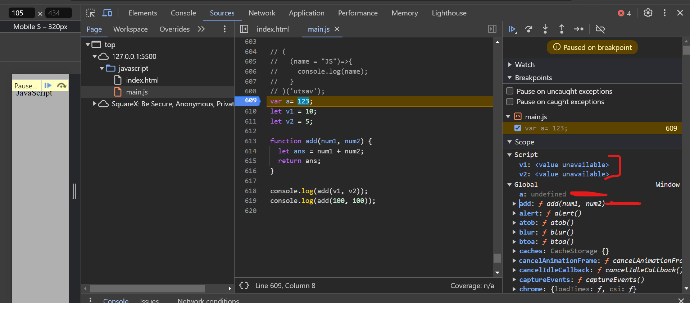
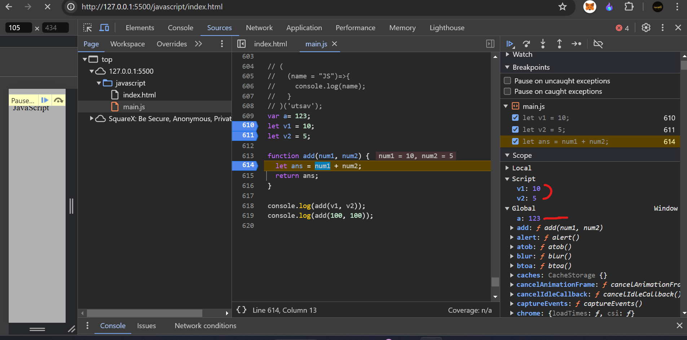
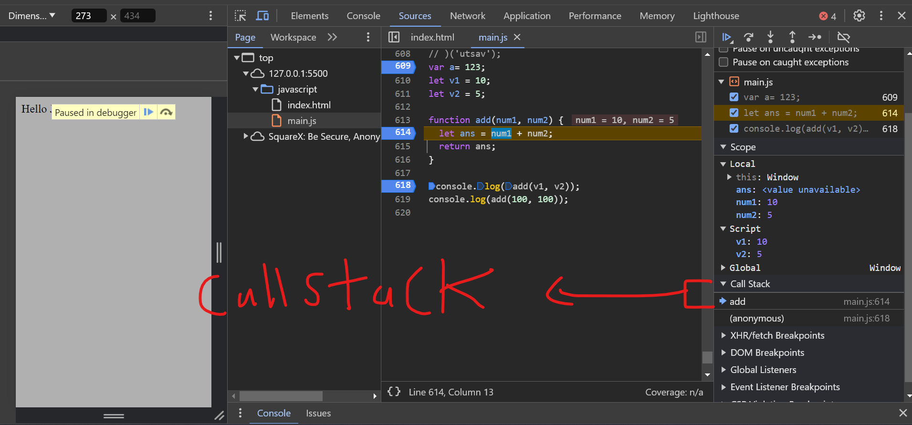
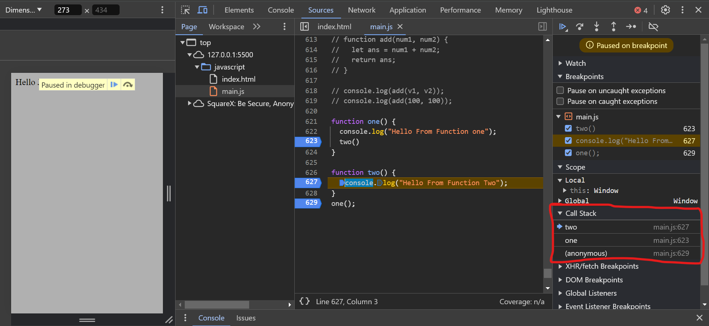
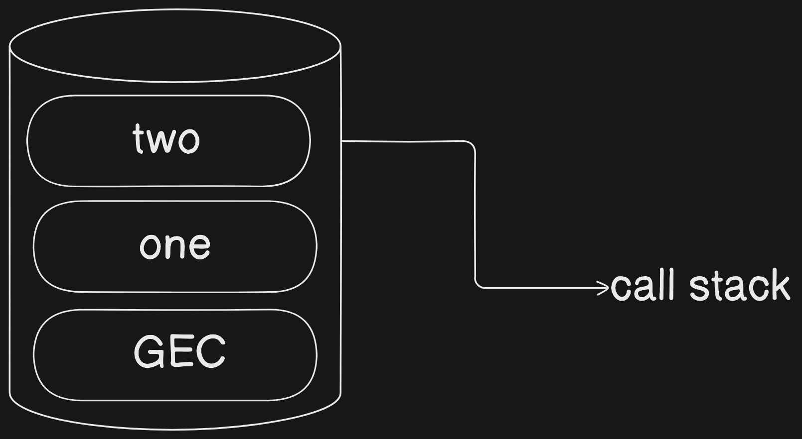

# part 2 of JavaScript

## TOC

1. [js working](#how-js-work)
2. [Truthy anf Falsy Value](#truthy-and-falsy-value)
3. [Advance Loops](#advanced-iterative-statements)
4. [Map](#maps)

## How JS work

- when ever JavaScript Execute , there is `Execution Context` is created.
- JS is single threaded langauge .

```js
let a = 12;
console.log(a);
```

- let's assume above code is execute.

1. Global Execution Context (`this`)
2. Function Execution Context (For `Function`)
3. Eval Execution Context (property of Global execution)

- in interview can say `2` execution context created than ok .
- the whole JS Code Execution in `2 phase` .

1. Memory Creation Phase (Memory Creation Phase)
2. Code Execution Phase (Execution Phase)

- let's understand those 2 phase using below example .

```js
let a = 123;
let v1 = 10;
let v2 = 5;
function add(num1, num2) {
  let ans = num1 + num2;
  return ans;
}
console.log(add(v1, v2));
console.log(add(100, 100));
```

- When above code start execute then

1. Global Execution Context is created (`this` , `Window` object for Browser)
2. Memory For all variable are allocated and set `undefined` value for all variable includeig `let` and `const` and for the function whole function statement copy into function name (function defination) , i only decalre function not a invoke the function



3. Execution Phase in this phase all the value of variable replace `undefined`



4. now `console.log(add(v1, v2));` line encounted here function is invoked , so another Execution contex is created for the function but now it is not a Global Exceution contex

5. in Function we have varibale call `ans ` in is value set to the `undefined` and even for `num1`, `num2` parameter and set value `undefined` .

6. then perform addition operation than return the value to the caller (`Global Execution context`) .

7. and print the value `15`

8. And Function Execution context Will Destory

9. next line execute it is also function so again `Function Execution Context Created`

10. Same agian memory creation phase and code excution phase start and end.

- in between this call stack also create as per function execute .



- Graphical Example of Call stack for the below code

```js
function one() {
  console.log("Hello From Function one");
  two();
}

function two() {
  console.log("Hello From Function Two");
}
one();
```

- one function one call than `Hello From Function one` will print after that function two call and `Hello From Function Two` will print till here global exacution context at bottom of the Call Stack .
- than function one call and it will place at up from `global exacution context` than function two call and function two place top of function `one` execution context
- firstly two execution context destory than function one execution context destory and if thrie on statement so even global execution will also destory .



- call stack have concept of `LIFO` aka Last In First Out .



## Truthy and Falsy Value

- `Falsy` value is a value that considered `false` when encounted in a `boolean` context .

- `Falsy` values

| Value          | Type      | Note              |
| -------------- | --------- | ----------------- |
| null           | null      | -                 |
| NaN            | Number    | -                 |
| undefined      | undefined | -                 |
| 0              | Number    | -                 |
| -0             | Number    | -                 |
| false          | Boolean   | -                 |
| 0n             | BigInt    | -                 |
| ""             | string    | Empty string      |
| `document.all` | Object    | only falsy Object |

```js
false == 0; // true
0 == ""; // true
false == ""; // true
```

- `Truthy` values are all the values that is other than `Falsy` value .
- `"0"` , `function() {}` , `[]` , `{}` , `'false'`

### Nullish Coalescing operator

- `leftoperands ?? rightoperands` .
- whole game on `null` and `undefined`.
- it return right side operands when left side operands is `null` or `undefined` other wise it return left side operands

- `null ?? 10` - > `10`
- `undefined ?? 10` - > `10`
- `11 ?? 10` -> `11`

## Advanced Iterative Statements

### Part 1

1. `for...in` - iterates on `properties` aka `key` of object , loop on object `key`

```js
let obj = {
  name: "Utsav",
  age: 17,
};

for (let key in obj) {
  console.log(key, obj[key]);
}
```

- `for...in` in array

```js
let arr = ["html", "css", "js", "react js", "next js", "express js"];

for (let key in arr) {
  console.log(arr); //  we only get key aka array index
  console.log(arr[key]); // now can print whole array each item
}
```

- `for...in` in `maps`

```js
let map1 = new Map();

map1.set("1", 1);
map1.set("2", 2);
map1.set("3", 3);
map1.set("1", 1);

for (let key in map1) {
  console.log(key);
}
```

2. `for...of` - use on iterate over a value of an iterable object such as `array` , `map` ,`set` , `string` .

- `[" "," "," "]` , `[{ },{ },{ }]`

```js
let num = [1, 2, 3, 4];

for (let value of num) {
  console.log(value);
}

let greet = "Hello World";

for (let ch of greet) {
  if (ch == " ") {
    continue;
  }
  console.log(ch);
}
```

- in above each loop don't require loop updation

```js
let obj = {
  name: "Utsav",
  age: 17,
};

for (let key of obj) {
  console.log(key); // obj is not iterable
}
```

---

### Part 2


- from here all loops are more usefull main for `Array` .

1. `forEach()` - most usefull loop or `Array method`

- this method use when we perform any operation on `each` array element . but no return

```js
let language = ["JavaScript", "C", "C++", "Java", "Python"];

language.forEach(function (val) {
  console.log(val);
});

language.forEach((value, index, arr) => {
  console.log(`${value} index is ${index} in ${arr}`);
});

function printArr(value) {
  console.log(value);
}

language.forEach(printArr);

const users = [
  {
    id: 101,
    name: "Utsav",
  },
  {
    id: 102,
    name: "Harry",
  },
  {
    id: 103,
    name: "Mark",
  },
  {
    id: 104,
    name: "Sam",
  },
];

users.forEach((user) => {
  console.log(`at ${user.id} username is ${user.name}`);
});

let numberArray = [1, 2, 3, 4, 5, 6, 7, 8, 9, 10];

let newNum = [];

numberArray.forEach((num) => {
  if (num % 2 === 0) {
    newNum.push(num);
  }
});
```

```js
let newArray = [];

numberArray.forEach((num) => {
  newArray.push(num + 10);
});
```

- here we are trying to return value when value is java but we got `undefined`.

```js
let loopval = language.forEach((value, index, arr) => {
  console.log(`${value} index is ${index} in ${arr}`);
  if (value === "Java") {
    return value;
  }
});
```

2. `fillter` -

- almost similar to `forEach` but main differnt is that it return a value.
- and return as per our `condition`

```js
let numberArray = [1, 2, 3, 4, 5, 6, 7, 8, 9, 10];

let evenNumber = numberArray.filter((number) => {
  return number % 2 === 0;
  // number & 1 === 1
});

console.log(evenNumber);
let evenNumber = numberArray.filter((num) => num % 2 === 0); // implicit return
```

3. `map` -

- easier than `filter`
- `map` is used when we need to create new array based on the current array .

```js
let numberArray = [1, 2, 3, 4, 5, 6, 7, 8, 9, 10];

let valuePlus10 = numberArray.map((num) => {
  return num + 10;
});

console.log(valuePlus10); //  [11, 12, 13, 14, 15, 16, 17, 18, 19, 20]
console.log(numberArray); // [1, 2, 3, 4, 5, 6, 7, 8, 9, 10]
```

- chaining
- up to `N` number of chaining possible

```js
let newNumArr = numberArray
  .map((num) => num * 10)
  .map((num) => num + 1)
  .filter((num) => num > 60);

console.log(newNumArr);
```

4. `reduce` -

```js
let num = [1, 2, 3, 4, 5];

let sum = 0;

let totalArr = num.reduce((acc, cValue) => {
  console.log(`${acc} :- ${cValue}`);
  return acc + cValue;
}, sum); // the whole reduce method start from here init value , it start form inital value than reduce method start

console.log(totalArr);
console.log(sum);

const shoppingCart = [
  {
    itemName: "js course",
    price: 2999,
  },
  {
    itemName: "py course",
    price: 999,
  },
  {
    itemName: "mobile dev course",
    price: 5999,
  },
  {
    itemName: "data science course",
    price: 12999,
  },
];

const total = shoppingCart.reduce((acc, cValue) => acc + cValue.price, 0);

console.log(total);
```

## Maps

- `maps` are similar to `object` they remebere the orignal insertion order of keys .
- `maps` are `unique`

```js
let map1 = new Map();

map1.set("1", 1);
map1.set("2", 2);
map1.set("3", 3);
map1.set("1", 1);

console.log(map1);
console.log(map1.get("1"));
console.log(map1.get("z"));

console.log(map1.keys());
console.log(map1.values());
console.log(map1.has("z"));
let one = map1.entries();

console.log(one.next("1"));
console.log(map1.size);
```

- `new Map()` - create a new map instance.
- `Map.set()` - set value (only uniuqe).
- `Map.get('<key require>')` - retrive the value
- `Map.has('<key>')` - return `true` or `false`
- `Map.keys()` - return only `keys`
- `Map.values()` - return only values
- `Map.entries()` - return a new `map` instanse that contain `map` object

```js
let map1 = new Map();

map1.set("1", 1);
map1.set("2", 2);
map1.set("3", 3);
map1.set("1", 1);

for (let [key, value] of map1) {
  console.log(`${key} :- ${value}`);
}

console.log(map1);
```
