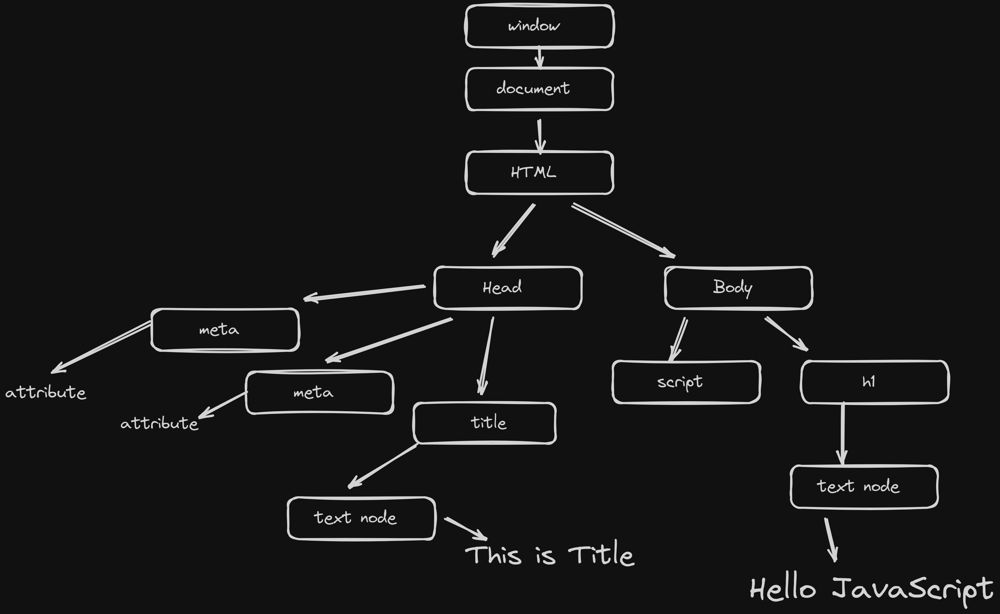

# JavaScript Dom

## TOC

1. [dom](#dom)
2. [Event](#Events)

## DOM

- DOM stand for `Document Object Model`.
- [MDN Dom](https://developer.mozilla.org/en-US/docs/Web/API/Document)
-

```js
<!DOCTYPE html>
<html lang="en">
  <head>
    <meta charset="UTF-8" />
    <meta name="viewport" content="width=device-width, initial-scale=1.0" />
    <title>This is Title</title>
  </head>
  <body>
    <h1>Hello JavaScript</h1>
    <script src="main.js"></script>
  </body>
</html>


```

- for this above `HTML` code `DOM` parse like this
  **NOTE:-** this is only for `visualization`

  - 

- selecting `HTML` Elements

1. `document.getElementById("id")` - based on id
2. `document.getElementsByClassName("heading")` - based on class name return `HTMLcollection` that is differnt from `NodeList`
3. `document.getElementsByName("this is heading")` - based on `name` attribute return `NodeList`
4. `document.getElementsByTagName("h1")` - based on html tag
5. `document.querySelector('h1')` - by `id` , `tag` , `class` ,`name` but select only one element
6. `document.querySelectorAll('h1')` - same `querySelector` bu select multiple element it return `NodeList` not an array

---

- `document.getElementById("title").className` - we get class names
- `document.getElementById("title").getAttribute('id')` - we get attribute based on key (`id`,`class`)
- `document.getElementById("title").setAttribute("title", "this is title")` - we can set attribute always overwrite
- `End More`

---

retrive text from Element

1. `Element.textContent` - return text of elements even of descendant
2. `Element.innerText` - return renders (a contatin that is display on browser) text
3. `Element.innerHTML` - we get element deatils with nested elements .

---

### Element Family

1. `Element.children` - return `HTMLcollection`
2. `Element.lastElementChild` return `last` element from selected element
3. `Element.firstElementChild` - return `First` element from selected element
4. `Element.lastChild` and `Element.firstChild` - return `last` and `first` child from selected element
5. `Element.parentElement` - return `parent Element` to the selected element
6. `Element.nextElementSibling` - return next element
7. `Element.childNodes` - return all nodes includeing `new line` , `tags` , `comment`

### Add and removing Element

- set style and much more

```js
const div = document.createElement("div"); // create element

// div.innerText = "Hello World from JS"; // way 1 to add text always overwrite
div.setAttribute("title", "hello from js"); // set attributes
div.style.backgroundColor = "red"; // css
div.style.padding = "4rem"; //  css
let txt = document.createTextNode("Hello World from js"); // way 1 to add text
div.append(txt); //  multiple element or can be string
weekDiv.appendChild(div); // only one element can add
```

- `Element.remove()` - remove Element

```js
function addListItems(langauge) {
  let li = document.createElement("li");
  li.textContent = `${langauge}`;
  document.querySelector(".langauges").appendChild(li);
}

addListItems("C");
```

```js
function addListItems(langauge) {
  let li = document.createElement("li");
  li.appendChild(document.createTextNode(langauge));
  document.querySelector(".langauges").appendChild(li);
}
```

## Events

- all js `Event` run one by one
- mainly two types of event

1. `Browser Event`

- event that is triggerd on user interaction
- `click`,`mousedown` , `load` , `submit` events etc.

2. `Environement Events`

- event that is triggerd by outside of the browser direct control .

```html

```

- not scalabel approach in React above code is good .

- we can use `addEventListener` , due to it provide various type of event and some new technique .
- when `Event` occure we got Event Object and it has lots of useFull attributes and other thigs

```js
window.addEventListener("click", (e) => {
  console.log(e);
});
```

- in above code i add click event on whole `window` , and in the callback function i passed `e` as argument and it provide Event object

- from the event object here small list of usefull property and some methods

1. `e.type` - return type of event
2. `e.timeStamp` - return a timeStamp based on from 1 jan 1970 00:00:00 UTC
3. `e.defaultPrevented` - from preven from its default behaviour
4. `e.target` - it return target element
5. `e.srcElement` - same as above but now don't use
6. `e.currentTarget` - this return where event is attech
7. `e.clientX` , `e.clientY` - return x and y axis from the page window
8. `e.screenX` , `e.screenY` - return x and y axis based on screen
9. `e.altKey`,` e.ctrlKey`,` e.shiftKey` - return boolvalue that based on `alt` , `ctrl` , `shift` key press or not

### Event propagation, capturing, bubbling

- Event propagation - means that in which order element recived the event , and from here we have two new words come `bubbling` (bydefault) , `capturing`

- from event bubbling code :-
- when i click on child box (box2) it run that event first than it parent or ancestors event

```html
<div
  style="border: 2px solid red; padding: 2rem; background-color: rgb(28, 38, 28)"
  class="box1"
>
  hi i am parent
  <div
    style="border: 2px solid pink; padding: 10px;  background-color: rgb(212, 80, 27)"
    class="box2"
  >
    hi i am child
  </div>
</div>
```

```js
document.querySelector(".box1").addEventListener("click", () => {
  console.log("Box 1 Clicked from parent");
});

document.querySelector(".box2").addEventListener("click", () => {
  console.log("Box 2 Clicked from child");
});
// ------------------------------------------
// ------------------------------------------
//            SAME AS ABOVE
// ------------------------------------------
// ------------------------------------------
document.querySelector(".box1").addEventListener(
  "click",
  () => {
    console.log("Box 1 Clicked from parent");
  },
  false
);

document.querySelector(".box2").addEventListener(
  "click",
  () => {
    console.log("Box 2 Clicked from child");
  },
  false
);
```

1. `bubbling` - run event for the own component than its parent compnent event just like bubble bottom to top

2. `capturing` - `opposite` of bubbling top to bottom

- now first `box1` event called than `box2`

```js
document.querySelector(".box1").addEventListener(
  "click",
  () => {
    console.log("Box 1 Clicked from parent");
  },
  true
);

document.querySelector(".box2").addEventListener(
  "click",
  () => {
    console.log("Box 2 Clicked from child");
  },
  true
);
```
