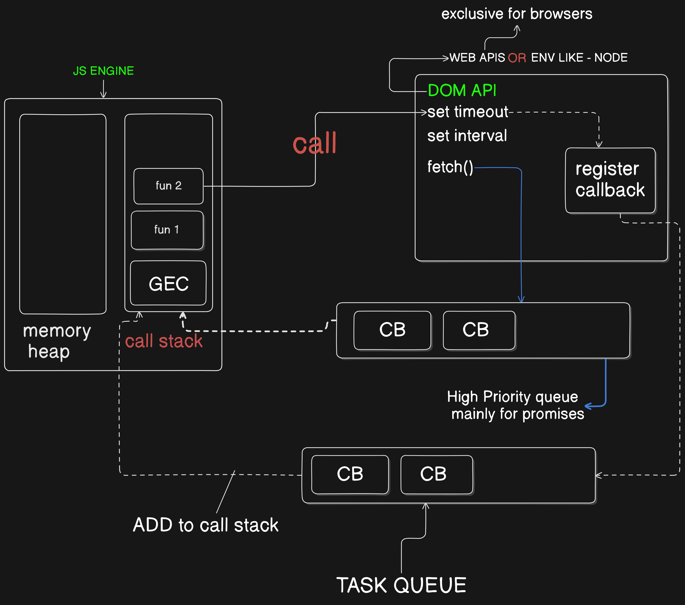

# JS async

## TOC

1. [theory](#theory)
2. [with code](#with-code)

## theory

**Note** - `JavaScript` is synchronous language (by default) , single threaed langauge .

- mainly two of writing code .

1. `Blocking code` - block the code execution , read file `sync`
2. `Non blocking code` - does not block the execution of the code , read file `async`

- above both code writing style is imp both sytle depended on our use case



- for async javascript few things are imporant

1. JS engine - memory heap and Call stack
2. WEB API or Enviornment likes `Node` , `Deno` or `Bun` etc.
3. Task queue - it makes js async and fast
4. Promises queue - only for promises and its **priprity is high**

- when js program execute , firstly execution comtext is created and one by one function loaded into top of the Global Execuution Context in call stack and if function execution is finished than it would unload
- when we write `async` js code some problem created just like :-

  > if code is `async` their is some resource or meachnisome who remind `async` task aftre complition of `sync` code

- for sloving this problem we have some API likes `Web api` or `Node api`
- let exaplin from below code

```js
function one() {
  function two() {
    setTimeout(function () {
      console.log("Hello From setTimeout !!!");
    }, 2000);
  }
  two();
}
one();
```

<p style="text-align: center;"> OUTPUT </p>

```txt
undefined
Hello From setTimeout !!!
```

- here from function two we have setTimeout , and setTimeout will execute after `2000 ms` means `2 second` as i define in second argument and other code execute it self with no blocking

- thier is a `Register Callback` who note or registaion the setTimeout execute after `2000 ms`

- `Register Callback` also register `x` work complete after when any specifec button click , do `y` work after when hover on certain button or any browser event or something happend or execute after load complete , something remove or something add and ABC etc .

- `Register Callback` register `async` task when it need to execute than once agian need to add in call stack so in between `Register Callback` and `Callstack` (in LIFO order) their is `Task Queue` that add task in `task queue` in FIFO order and than execute that task

- for `fetch` api we have separate `task queue` or we can say , `task queue` has been expanded but is has **higher priority** or even know as **MICROTASK QUEUE** than normal `task queue` [click here to read about it](\05-api-promises.md)

## with code

- below code execute after 2 second for only one time
- `setTimeout` take some argument first handler (function without name or function references)and second argument is time in milisecond than up to N argument for callback function

```js
setTimeout(function () {
  console.log("after 2 second i will print");
}, 2000);
```

- we can set and remove (clear) `setTimeout` with its references (with the help of variable)

```js
let num = 12;
let printwithSetTime = function (timeinS) {
  console.log(`print aftre  ${timeinS} seconed`);
};

let time = setTimeout(printwithSetTime, 2000, 2);

if (num === 3) {
  setTimeout(time);
  console.log("set timeout is clear");
}
```

- if we want to execute block of code multiple time we can use `setInterval` .
