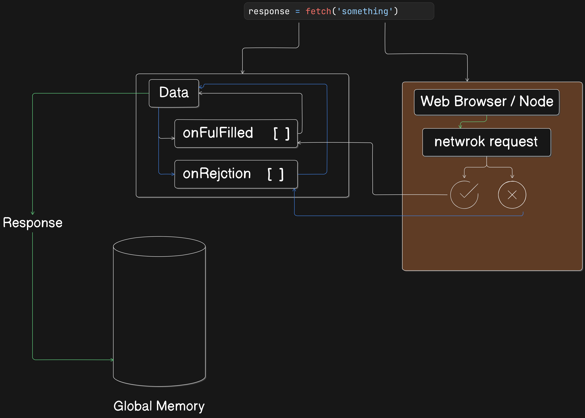

# JS , API and other things

## TOC

1. [basic about API](#few-words-about-api)
2. [XMLHttpRequest](#xmlhttprequest)
3. [Promises](#promises)
4. [Fetch](#fetch)

## few words about API

**NOTE** - this section may update in future .

- `API` stand for `Application Programming Interface`.
- It is a communication channel between front-end and backend

## XMLHttpRequest

- this is old way to call api in js (you may be learn about this is anywhere but now days developer don't use it but knowing this can be help full )

- use of `XMLhttpRequest`

1. create `XMLhttpRequest` object

- with help of `new` keyword and store in variable

```js
let xhr = new XMLHttpRequest();
```

2. make a request and sending request

```js
const URL = "https://api.github.com/users/its-utsav";
xhr.open("GET", URL, true); // set url
xhr.send();
```

- after making reqest below table came in picture

| Value | State              | Description                                                     |
| ----- | ------------------ | --------------------------------------------------------------- |
| `0`   | `UNSENT`           | Client has been created. `open()` not called yet.               |
| `1`   | `OPENED`           | `open()` has been called.                                       |
| `2`   | `HEADERS_RECEIVED` | `send()` has been called, and headers and status are available. |
| `3`   | `LOADING`          | Downloading; `responseText` holds partial data.                 |
| `4`   | `DONE`             | The operation is complete.                                      |

- for tracking the state change we an use below code

```js
xhr.onreadystatechange = function () {
  console.log(xhr.readyState); // when ever state change
};

console.log(xhr.status); // for code like 404 (Not found) OR 200 (Data recieve) etc
```

```js
const GITHUBURL = "https://api.github.com/users/hiteshchoudhary";
let xhr = new XMLHttpRequest();

xhr.open("GET", GITHUBURL, true);

xhr.send();

function displayOnPage(url, imgURl, name, followers, bio) {
  document.body.innerHTML = `<section class="h-screen w-screen flex items-center justify-center text-black">
  <div class="max-w-screen-sm m-4 flex flex-col rounded-xl bg-slate-300 p-2 duration-300 h-72">
    <div class="m-3 flex items-center justify-center">
      <a href=${url} target="_blank">
        
      </a>
    </div>
    <div class="bg-green-400 p-4 text-center font-semibold">
      ${name}
      <p><span class="font-normal capitalize"> followers </span> : ${followers}</p>
    </div>
    <div class="flex items-center py-2 text-center">
      <p class="text-lg">Bio:-</p>
      <p class="ml-3 hover:shadow">${bio}</p>
    </div>
  </div>`;
}

xhr.onreadystatechange = function () {
  if (xhr.readyState === 4 && xhr.status === 200) {
    let data = JSON.parse(this.response); // get string conver into object
    displayOnPage(
      GITHUBURL,
      data.avatar_url,
      data.name,
      data.followers,
      data.bio
    );
  } else {
    document.body.innerHTML = `<div class="h-screen w-screen bg-slate-900 flex items-center justify-center ">
    <h2 class="text-center text-4xl capitalize p-4 text-white font-bold">unable to load data from github status code :- ${xhr.status}</h2>
  </div>`;
  }
};

xhr.onerror = function () {
  document.body.innerHTML = `<div class="h-screen w-screen bg-slate-900 flex items-center justify-center ">
  <h2 class="text-center text-4xl capitalize p-4 text-white font-bold">unable to load data from github status code :- ${xhr.status}</h2>
</div>`;
};
```

- even we can execute block of code when we get error using `xhr.onerror`

## Promises

- the `promise` is the object that represent the eventual completion (or failure) of am asymchronous opreation and its resulting the value

- promises have 3 state

1. pending - initial state
2. fulfilled - means operation complete successfuly
3. rejected - means operation faild

- in most of time we consumed promises but knowing how to create a promises can help to understrand `fetch` , `async/await` etc .

1. createing promises

- with the help of `new` keyword we can create a new promise object .
- its just like a normal function , promise also help to reduse callback hell
- promise have to part first promise may resolve or may be reject

```js
const primoseOne = new Promise(function (resolve, reject) {});
```

```js
const primoseOne = new Promise(function (resolve, reject) {
  // async task
  // DB call
  // cryptography, network

  setTimeout(function () {
    console.log(`async task complete successfuly`);
    resolve(); // connet with .than
    // if this line we didn't write than .than never execute
  }, 1000);
});
```

2. consumed promise

```js
primoseOne.then(function () {
  console.log(`promises consumed`);
});
```

---

whole code

```js
const primoseOne = new Promise(function (resolve, reject) {
  // async task
  // DB call
  // cryptography, network

  setTimeout(function () {
    console.log(`async task complete successfuly`);
    resolve(); // connet with .than
    // if this line we didn't write than .than never execute
  }, 1000);
});

primoseOne.then(function () {
  console.log(`promises consumed`);
});
```

- Data consumption

```js
let promiseThree = new Promise((res, rej) => {
  setTimeout(() => {
    res({ username: "Utsav", age: 17 });
  }, 1000);
});

promiseThree.then((data) => {
  console.log(data.username); // Utsav will create
});
```

- below is example of creating promise and consuming proimise with if error ocure (in catch block) , and use of `finally` block to excute block of code 100 % (even if error or promise complete)

```js
let promiseFour = new Promise((res, rej) => {
  setTimeout(() => {
    let err = false; // chnage to the true
    if (!err) {
      res({ username: "Utsav", age: 17 });
    } else {
      rej("something wrong");
    }
  }, 2000);
});

promiseFour
  .then((data) => {
    if ("username" in data) {
      return data.username;
    } else {
      return "JavaScript";
    }
  })
  .then((username) => {
    console.log(username);
  })
  .catch((err) => {
    console.error(err);
  })
  .finally(() => {
    console.log(`promise Four complete successfully or with error`);
  });
```

- simple promise will complete in future so we may way to consume promise so we can use `async` / `await`

- `async` / `await` is similar to `.then` , `.catch` but **`async`/`await` don't handle error directly we need handle error explicit using try/catch block**

```js
const promiseFive = new Promise((res, rej) => {
  setTimeout(() => {
    let err = false;
    if (!err) {
      res({ username: "utsav", age: 17 });
    } else {
      rej("SOMETHING WRONG");
    }
  }, 1000);
});

async function consumePromiseFive() {
  try {
    let res = await promiseFive;
    let username = "JavaScript";
    if ("username" in res) {
      username = res.username;
    }
    console.log(username);
  } catch (err) {
    console.error(err);
  }
}

consumePromiseFive();
```

- api request

```js
async function apifunction() {
  try {
    const response = await fetch("https://jsonplaceholder.typicode.com/users");
    const jsonData = await response.json();
    console.log(jsonData);
  } catch (err) {
    console.error(err);
  }
}

apifunction();

const APIURL = "https://jsonplaceholder.typicode.com/users";

fetch(APIURL)
  .then((res) => {
    return res.json();
  })
  .then((data) => {
    console.log(data);
  })
  .catch((err) => {
    console.error(err);
  });
```

- **NOTE** - `fetch` have more prioriy than normal async task

## Fetch

**NOTE** - here some words may be use for explniray purpose some books may have differnt names

- when we use `fetch` it whole work compelete in two part

1. Web Browser / Node
2. space reserve in memory (kind of `Data`) aka memory allocte



- explaintion for above image
- for step 2 space reserve in memory (kind of `Data`)

- data has two array (kind of)
  1. `onFulfilled[]` - promise's resolve part
  2. `onRejection[]` - promise's rejection part
- we don't have access to direct interact with above (kind of) array it is completely private even data
- than second part for network request `fetch` (we) used browser or `node` based API
- network request has only two possiblity

  1. we get data

     - if data recevie than always go in on `onFulfilled[]` or reslove

     - this include all type of code even error code like `200` or `404` or `500` **interview question**

  2. we don't recevie data
     - if no network request than go in on `onRejection[]` or rejection

- for the data is value is empty (or may be undefined)

- once network request work is complete thier is only two possibility it will fire `onFulfilled[]` (if any kind of data recive) , `onRejection[]` (unable to network request) , both array have some function and those function are responsible for fulfulling data

- once data fulfuiled than its value is set for response
