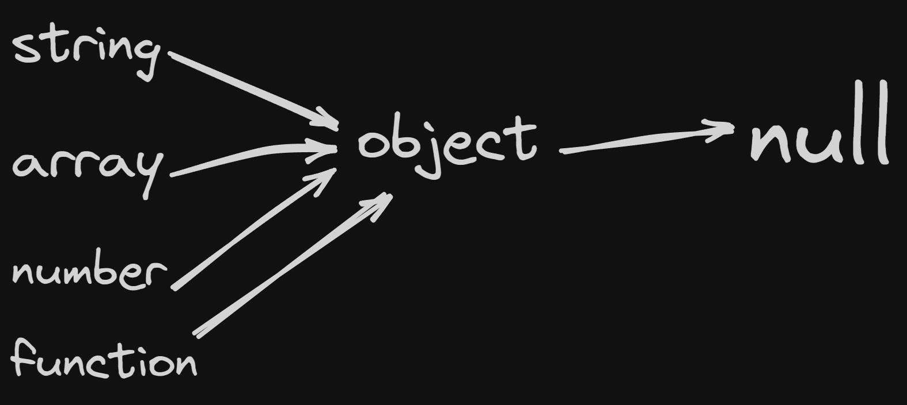

# OOP and adnaced Js

## TOC

1. [oop](#oop)
2. [advanced about object](#advanced-about-object)
3. [getter and setter](#getter-and-setter)

## oop

- js support `oop` but js approch to `oops` is differnt from traditional class based language like `c++` , `java` .

- Object Oriented Programming (oop) is a just programming paradigm (code writing technique) in js oop based on `Object` that contain data in the form of properties and code in form of method . 😵😕

- simple word

### object

- collection of properties and method

1. why oop used ?

   - Make the development and maintenance of projects more effortless.
   - Provide the feature of data hiding that is good for security concerns.
   - Solve real-world problems.
   - Ensure code reusability.
   - Package together data states and functionality to modify those data states, while keeping the details hidden away.
   - simple - prevent from `Spaghetti code` [wikipedia](https://en.wikipedia.org/wiki/Spaghetti_code)
   - Spaghetti code is a pejorative phrase for `unstructured` and `difficult-to-maintain source code`.

2. Parts of `oop` ?

- here part of oop focus on `JavaScript`
  - [Object Literl](#object-literal)
  - [Constructor Function](#constructor-function)
  - [Proto OR Prototype](#prototype)
  - [Classes](#classes)
  - Instance (keywords like `new` , `this`)

3. Pillars of `oop` :-

- same in all `opp` supported language
- only diffrent in syntax
  - Abstraction
  - Encapsulation
  - [Inheritance](#inheritance)
  - Polymorphism
- [more about oop](#more-about-opp)

4. [call apply and bind](#call-apply-bind)

### Object literal

- before goning on class or other oop concept once agian revise object

- in js object consider as based unit or object literal

```js
const user = {
  name: "Utsav",
  age: 17,
  gender: "male",
  getUserInfo: function () {
    console.log(this); // print current contex
    console.log(
      `Hi ${this.name} and ${this.gender == "male" ? "his" : "her"} age is ${
        this.age
      }` // here this is very imp for current contex
    );
  },
};

console.log(user); // whole object
user.getUserInfo(); // function called
```

### Constructor Function

- from the above code we need to create a `user2` for creating `user2` whole code we need to write code again which is unneccesory and code repeataion

- so here `constructor function` play crucial role

- it allow us to create multiple intsnace from single object

```js
let prmOne = new Promise(); // example of constructor function
let date = new Date();
```

- example

```js
function User(userName, age, gender) {
  // variable   = value
  this.userName = userName;
  this.age = age;
  this.gender = gender;

  this.greet = function () {
    console.log(
      `Hi ${this.name} and ${this.gender == "male" ? "his" : "her"} age is ${
        this.age
      }`
    );
  };

  // return this; // optional
}

let userOne = new User("utsav", 17, "male");

let userTwo = new User("Sam", 23, "male");

console.log(userOne);
console.log(userTwo);

console.log(userOne instanceof User); // check instance or not
```

- if we don't write `new` kewyword before creating object instance it previous value always overwrite by new instance

- when we use `new` keyword

1. empty object create known as instance
2. call constructor function called due to `new` keyword pack all argument and give to us .
3. due to `this` all argument inject in variable
4. new object return complete process

### Prototype

- it is all about JavaScript beheviour , unique and intersting
- it is impoerant understand why javascript doing that
- also imporant in interview (beginer level and most advanced interview question is SDE level )

- JavaScript beveviour is prototypel .

- if something is not find by js , it still keep searching for that thing it try to access parent if not found than go in grandparent again if not found than it go grand grand parent . and this process till continue till it not got `null`.

- due to Prototype we have `this` , `new` and also inheritance or prototypel inheritance

- in js everything is object even function and array .
- in js function is function and function can be object.
- we can use function as function and function can behevie like object

```js
function multiplyBy5(num) {
  return Number(num * 5);
}

multiplyBy5.power = 10;

console.log(multiplyBy5(5)); // 25
console.log(multiplyBy5.power); // 10
console.log(multiplyBy5.prototype); // { } (empty object see below)
console.log(multiplyBy5); // whole function
```

- in js, function have `prototype` property , and it is a object .
- This `prototype` property is used when the function is used as a constructor to create instances. It holds properties and methods that should be available to instances of that function.
- Since `multiplyBy5` is not being used as a constructor, its `prototype` property is just an empty object `{}` by default.

- simple :- when we use function as constructor it will help

```js
function createUser(username, score) {
  this.username = username;
  this.price = score;
}

createUser.prototype.increment = function () {
  // score++; // not work because current context is missing
  this.price++;
};

createUser.prototype.printPrice = function () {
  console.log(`price is ${this.price}`);
};

console.log(createUser);
console.log(createUser.prototype);
let one = new createUser("Utsav", 100);

one.printPrice();

one.increment();
one.printPrice();

one.increment();
one.printPrice();
```

- some explation about `new` keyword

- A new object is created: The new keyword initiates the creation of a new JavaScript object.

- A prototype is linked: The newly created object gets linked to the prototype property of the constructor function. This means that it has access to properties and methods defined on the constructor's prototype.

- The constructor is called: The constructor function is called with the specified arguments and this is bound to the newly created object. If no explicit return value is specified from the constructor, JavaScript assumes this, the newly created object, to be the intended return value.

- The new object is returned: After the constructor function has been called, if it doesn't return a non-primitive value (object, array, function, etc.), the newly created object is returned.

- real life example of prototype

```js
let myName = "Utsav     ";

console.log(myName.length); // give 10 but their is only 5 character and 5 spaec
// for removing space and for real length for string i need to use trim() method like this

console.log(myName.trim().length); // remove white space and give length
// what if i need to make function / method for this

// answer
String.prototype.trueLengthOfString = function () {
  return console.log(Number(this.trim().length));
};
```

- why this is possible ?
  

- here we add own method in `String` object if we add something in `Object` level than it can be accessible to all object but here we add `trueLengthOfString()` method into only `String` object so it only avialable for string

---

- in below example we add own method in `Object` so it avaible for all other object

```js
let heroArr = ["Thor", "Spider man"];

let heroPower = {
  thor: "Hammer",
  spiderman: "spidy",

  getSpiderPower: function () {
    console.log(`spider man power is ${this.spiderman}`);
  },
};

Object.prototype.UtsavSayHello = function () {
  console.log(`Hello from Utsav `);
};

heroPower.UtsavSayHello();
heroArr.UtsavSayHello();
```

### Classes

- in all about syntactic suger ober the js Prototype

```js
class User {
  constructor(username, email, password) {
    this.username = username;
    this.email = email;
    this.password = password;
  }

  // Method
  encryptPass() {
    return console.log(`${this.password}${Math.random() * 10}`);
  }
}

let userOne = new User("Utsav", "utsav@example.com", 123);

console.log(userOne);

userOne.encryptPass();
```

- behind the scene

```js
function User(username, email, password) {
  this.username = username;
  this.email = email;
  this.password = password;
}

User.prototype.encryptPass = function () {
  return console.log(`${this.password}${Math.random() * 100}`);
};

let userOne = new User("Utsav", "utsav@example.com", 123);

console.log(userOne);

userOne.encryptPass();
```

### Inheritance

```js
let human = {
  canFly: false,
  canTalk: true,
  willDead: true,
};

let itsMe = {
  name: "Utsav",
  // __proto__: human, // older syntax
};

// itsMe.__proto__ = human
Object.setPrototypeOf(itsMe, human); // newer syntax

console.log(itsMe);
```

- class based syntax

```js
class User {
  constructor(username) {
    this.username = username;
  }
  printUserInfo() {
    console.log(this.username);
  }
}

class Teacher extends User {
  // inherit from user
  constructor(username, email, password) {
    super(username); // same as call method

    this.email = email;
    this.password = password;
  }

  TeacherInfo() {
    console.log(`teacher name is ${this.username} and email ${this.email}`);
  }
}

const ht = new Teacher("hitesh houdhary", "ht@example.com", 123);

console.log(ht);

ht.TeacherInfo();

const userOne = new User("Utsav");

console.log(userOne);

userOne.printUserInfo();

ht.printUserInfo();
console.log(ht instanceof Teacher); // true
console.log(ht instanceof User); // true due to inheritance

// userOne.TeacherInfo(); // it will not work
```

### More about OPP

- static Method - method that is part of a class rather than an instance of that class

```js
class User {
  constructor(username) {
    this.username = username;
    User.userCount++;
  }

  logMe() {
    return console.log(this.username);
  }
  static userCount = 0;
  static TotalUser() {
    return console.log(`total user ${this.userCount}`);
  }
}

let userOne = new User("utsav");
let userTwo = new User("Sam");

console.log(userOne);
console.log(userTwo);

User.TotalUser();
```

### call-apply-bind

- the main purpose of `call` , `apply` and `bind` is change (control) the value of `this`
  in which function execute and `this` means it current context

- some by default value of this like if `this` located in :-

1. global -> `window` object `console.log(this)` in node `{ }`
2. function -> `window` object only normal `this`

```js
function x() {
  console.log(this);
}
x();
```

3. method -> return current `Object`

```js
let user = {
  name: "Utsav",
  age: 17,

  printUserInfo: function () {
    console.log(`i am ${this.name} , i am ${this.age}`);
    console.log(this);
  },
};

user.printUserInfo();
```

- `call`
- its syntax like this `functionName.call(this,Argument1,Argument2,Argument3,ArgumentN)` here `this` is optional (sometime)
- in below function we just outsourced `this.username = username` to the other function

```js
unction setUser(username) {
  this.username = username;
  console.log("called");
}
// problem is that above function is called but its execution context destrory so inside all variable is desotry
function createUser(username, email, password) {

  // setUser(username); // not working

  setUser.call(this, username);
  this.email = email;
  this.password = password;
}

let userOne = new createUser("Utsav", "utsav@example.com", "123");
console.log(userOne);
```

- simple example

```js
function one() {
  console.log(this);
}
let harry = { username: "harray" };
one.call(harry);
```

- `apply`
- it is almost similar as `call` but main diffenr is in `apply` syntax
- `functionName.apply(this,[argumentArray])` - this function take argument as array , here this (first param) is imporant otherwise it return `undefined`

```js
function one(name, age) {
  console.log(`${name} age is ${age}`);
}
one.apply(this, ["utsav", 17]);
```

- `bind`

- it is diffent from `call` and `apply` , this we need invoke function explicitly (even need to store function in variable)

```js
function person(name, age) {
  console.log(`${name} age is ${age}`);
}
let itsMe = { name: "Utsav" };

const bindFunction = person.bind(this, itsMe.name, 90);

bindFunction();
```

## Advanced About Object

1. interview question :- chnage the value of `Math.pi` `3.14` to `5` is it is possible or not with proper explanation .

```js
console.log(Math.PI); // 3.141592653589793

Math.PI = 5; // can't chnage

console.log(Math.PI); // 3.141592653589793
```

- lets se why it value can't change

```js
const info = Object.getOwnPropertyDescriptor(Math, "PI");
console.log(info);
```

- we get like this

```js
{
    "value": 3.141592653589793,
    "writable": false, // that why we can't change the value of PI
    "enumerable": false,
    "configurable": false
}
```

- even we can config own object

```js
const chai = {
  // Normal object
  name: "Green Tea",
  price: 250,
  isAvailable: true,

  printInfo: function () {
    console.log(`${this.name} - price ${this.price}`);
  },
};

Object.defineProperty(chai, "price", {
  writable: false, // now we can't rewrite
  enumerable: false, // price can't loop
});

chai.price = 2000; // will not work

for (let [key, value] of Object.entries(chai)) {
  if (typeof value !== "function") {
    console.log(`${key} : ${value}`); // price will not print
  }
}
```

## getter and setter

- `getter` ans `setter` are special method that provide a way to access and update the propertise of an object

- `get` and `set` are complementry to eachother once we set `get` than we must set `set` .
- by defualt for all propiertise already `getter` and `setter` available

most possible error ` Uncaught RangeError: Maximum call stack size exceeded`

- getter
- getter is a method that get the value of a property .
-

```js
class Person {
  constructor(firstName, lastName) {
    this.firstName = firstName;
    this.lastName = lastName;
  }

  get fullName() {
    return `${this.firstName} ${this.lastName}`;
  }
}

let utsav = new Person("Utsav", "Dhimmar");

console.log(utsav.fullName);
```

- setter
- setter are the method that set the value of property .
-

```js
class User {
  constructor(username, email) {
    this.username = username;
    this.email = email;
  }

  get username() {
    return this._username.toUpperCase(); // geting value
  }

  set username(value) {
    this._username = value; // seting the value
  }

  get email() {
    return this._email.toUpperCase();
  }

  set email(value) {
    this._email = value;
  }
}

const utsav = new User("Utsav", "utsav@example.com");
console.log(utsav);
console.log(utsav.username);
```

- function based

```js
function User(username, pass) {
  this._username = username;
  this._pass = pass;

  Object.defineProperty(this, "username", {
    get: function () {
      return this._username.toUpperCase();
    },
    set: function (value) {
      this._username = value;
    },
  });

  Object.defineProperty(this, "pass", {
    get: function () {
      return this._pass.toUpperCase() + 123;
    },
    set: function (value) {
      this._pass = value;
    },
  });
}
```

- rarest

```js
let User = {
  _username: "Utsav",
  _pass: "abc",
  get: function () {
    return this._pass.toUpperCase() + 123;
  },
  set: function (value) {
    this._pass = value;
  },
};
//
const utsav = Object.create(User); // factiry function

console.log(utsav);
```
